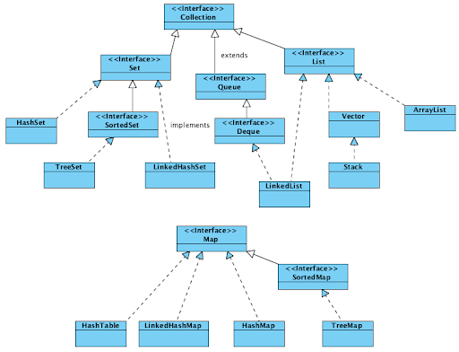

### Базовый класс в Java

Object

### Какие методы есть у класса object?

Clone, equals, finalize, getclass, hashcode, toString, notify, wait*

### Что за метод getclass?

Возвращает класс объекта

### Что можно назвать примитивным, а ссылочным типом данных

Примитивные копируются при присвоении (int, double, float, boolean), а ссылочные передаются по ссылке (все переменные ссылаются на один объект)

### Где хранятся ссылочные типы и примитивные. 

Зависит от того, где объявлена переменная, а не от ее типа. Локальные переменные хранятся в стеке. Экземпляры и статические переменные хранятся в куче.

### Для чего нужен метод clone? Какие типы клонирования есть?

Создает новый тип, не отличающийся от клонированного.
Бывает глубокое и не глубокое клонирование. При не глубоком – ссылки на вложенные объекты передаются новому экземпляру. При глубоком – копируются сами вложенные объекты и, соответственно, создаются новые ссылки

### Для чего существуют методы hashcode(), equals()

**Equals** – определяет равен ли один объект другому (равны ли *логически*, т.е. их *значимые* *поля*)
**Hashcode** – возвращает хэшкод, связанный с объектом

### Что возвращает хешкод?

Целое число (может быть и отрицательным) на основе конкретного объекта 

### Каким контрактом связаны между собой equals и хэш код? Зависят ли они друг от друга и как?

Два равных объекта должны возвращать одно и тоже число. Не равных – разные.

### Если объекты равны по equals, будут ли они равны по хэш код? Если equals не равен?

По контрактам - должны быть равны в первом случае и не равны во втором.

#### Что будет если сравнить 2 объекта с не переопределенным equals

По умолчанию метод сравнивает указатели на объект. Не один и тот же объект -> не равны.

### 4 контракта которые должны поддерживаться, когда equals переопределяется?

* x.equals(x) = true при x!=null
* x.equals(y) = true => y.equals(x) = true
* x.equals(y) == true && y.equals(z) == true => x.equals(z) == true
* если после x.equals(y) == result поля не менялись – должно также возвращаться result

### Может быть после переопределения equals, что a equals b, и при этом b не equals a? Операций между ними нет.

В теории да, но по контрактам это неправильно

### Какие возможны значения диапазона примитива int?

-2,147,483,648 -> 2,147,483,647

### Что если у нас больше объектов, чем включает этот диапазон? Что такое queue?

Это очередь. Очереди представляют структуру данных, работающую по принципу FIFO. 

### Как выглядит модель памяти Java? как устроен хип? на какие области памяти делится?

Память состоит из двух частей – heap(куча) и stack
**Heap** – выделение памяти под объекты. Здесь же происходит создание новых объектов и работает сборщик мусора (освобождает память путем удаления объектов, на которые нет каких-либо ссылок). Есть три разных части кучи – место под новые объекты, место под объекты, пережившие несколько сборок мусора и, третье, место под долгоживущие объекты. Первые две – область Young Generation, третья – Old Generation. Если в первой заканчивается место – происходить «быстрая очистка», если во второй – полная. Также есть Permanent Generation
**Stack** – работает по схеме LIFO. Всякий раз, когда вызывается метод, в памяти стека создается новый блок, который содержит примитивы и ссылки на другие объекты в методе. Как только метод заканчивает работу, блок также перестает использоваться, тем самым предоставляя доступ для следующего метода. Куча – всем приложением, стек – только одним потоком исполнения. В куче объект – в стеке ссылка на него и примитивы. Стэк быстрее кучи.

**Young Generation** — область где размещаются недавно созданные объекты. Когда она заполняется, происходит быстрая сборка мусора.

**Old (Tenured) Generation** — здесь хранятся долгоживущие объекты. Когда объекты из Young Generation достигают определенного порога "возраста", они перемещаются в Old Generation.

### Для чего нужен сборщик мусора?

Для освобождения памяти от неиспользуемых объектов. Можно запросить чистку, но не запустить ее. Два объекта с ссылками друг под друга могут быть утилизированы, если не доступны живому потоку.

### Как сборщик мусора поступает с сильными ссылками после первого прохода? 

Todo

### Как сборщик мусора понимает, что надо finalize вызвать у объекта? 

Этот метод вызывается для объекта сборщиком мусора, когда сборщик мусора вычисляет, что ссылок на объект больше нет. Когда приходит черед удалять объект из памяти.

### Метод finalize для чего нужен? В каких случаях нужно его использовать?

Метод вызывается перед удалением объекта. Служит для очистки памяти , финалиазции объекта в случае, когда при его удалении нужно освободит ресурсы, занятые им, например открытые файловые дескрипторы.

### Что такое generics?

Это параметризованные типы. С их помощью можно объявлять классы, интерфейсы и методы, где тип данных указан в виде параметра.

### Расскажите про коллекции в JAVA.

### Collections от чего-то наследуются?

Iterable<E>

### У листа какие есть реализации? В чем отличие linkedList и arrayList?

**ArrayList** (быстрее при чтении), **LinkedList** (быстрее при добавлении/удалении), **Stack**(LIFO)

### Реализация HashMap, устранение коллизий

https://habr.com/ru/post/128017/
Использует внутри хэш-таблицу. Для каждого ключа – хэшкод и хранение по ним. Размер по умолчанию – 16 ячеек. При необходимости увеличивается, но всегда кратный 2. 
**Сложность** - O (n) из-за прохождения через все записи.
При коллизии (добавление объекта с уже существующим ключом) есть три варианта развития событий:

* место свободно – помещаем туда значение,
* место занято и объекты по hashcode и equals разные – записать новое значение,
* место занято, объекты равны – связать старый и новый через LinkedList.

### Чем HashSet от HashMap отличается? Одинаковые объекты могут быть в них? Что использует HashSet внутри себя?

https://javarush.ru/groups/posts/2147-hashset-v-java
Отличаются реализуемыми интерфейсами (соответственно и форматом хранения данных).
В хэшсете – не может быть одинаковых элементов, а в мапе – ключей. 
Внутри хэшсета - hashmap

### Когда возникает ConcurrentModificationException в рамках коллекций?

Одновременное модификация одной коллекции из разных потоков. (Есть коллекции, которые поддерживают данную работу. Например ConcurrentHashMap)

### Synchronized что делает?

Помечает блок кода. Этот блок доступен для выполнения одновременно только одному потоку. Остальные ожидают.

### notify, notify all и wait для чего предназначены?

**Wait** – ставит тред на паузу(«замораживает») и освобождает объект, использованный для синхронизации
**Notify** – «размораживает» поставленный на паузу случайный поток
**NotifyAll** – «размораживает» все потоки

### Что если мы скажем Synchronized статическому методу класса?

Остальные потоки будут ждать как и с обычным методом

### Для чего нужен модификатор volatile?

Все актуальные изменения переменной доступны сразу для всех потоков, то есть операции присвоения и чтения должны быть атомарны что указывается компилятор.

### Есть такой пакет java.util.concurrent какие там есть группы (6 штук)? Что такое cyclicbarrier? Atomic boolean или atomic integer?

Todo
Атомарные boolean и integer подразумевают то, что все операции с ними атомарны, для работы с несколькими потоками.

### StringBuffer vs StringBuilder

todo

### Метод intern

Добавляет строку в пул уникальных строк, если таковой там нет. Возвращает ссылку на нее.

### Расскажите про дерево исключений. Желательно прям дерево расписать по иерархии - от чего наследуется, как в коллекциях. Check и Uncheck что означает?

Throwable -> Exception(checked) -> RuntimeException(unchecked)
Throwable -> Error(unchecked)
**Checked** – обязывает пользователя обработать ошибку через try-catch.
**Unchecked** – ни к чему не обязывает.

### Что такое error и какие бывают сообщения?

В основном критические ошибки – переполнение кучи/стека.

### Unmodifiable Class Exception что такое?

Возникает, если невозможно изменить класс в рантайме

### Как создать свой Exception?

Создать свой класс, расширяющий Exception

### Autoboxing/Unboxing 

Механизм позволяет использовать примитивы в generic типах, они автоматически пакуются в соответствующие классы и так же распаковываются. При использовании обобщенных типов мы не можем использовать примитивы, т.к. сами generics в runtime затираются (да-да, через рефлексию мы все равно можем вытащить эту информацию), а вместо них живет обычный Object и привидение к типу, которое добавляет компилятор. Однако Java позволяет приводить из примитивного типа к ссылочному, т.е. из int к java.lang.Integer и наоборот, что и называется autoboxing и unboxing соответственно. 

### Что такое итераторы?

Интерфейс, благодаря которому мы можем перебирать элементы любой коллекции вне зависимости от их внутренней реализации.

### Типы ссылок

**StrongReference**(не удаляется), 
**WeakReference**(удаляется при следующем проходе сборщика), 
**SoftReference**(удаляется только если jvm нужна память), 
**PhantomReference**(не возможно получить экземпляр через гет- возвращает всегда null)

### Как достучаться до метода, что помечен как private извне без вмешательства в код, например есть библиотека, подключается и там, где-то в классе, есть приватный метод, что очень нам нужен? Какие способы есть достучаться до этого метода и вызвать его?

Достучаться можно через Reflection Api. Нужно получить ссылку на метод/поле, сделать его доступным(setAccessible(true)), и убрать, если нужно, final. Затем можно устанавливать свои значения.

### Если мы переопределяем метод базового класса (не абстрактного) и внутри базового класса есть логика, которая вызывает этот метод. Чей метод будет вызван?

Метод потомка.

### Какое имя у процесса приложения? Как этот процесс стартуется?

Todo
